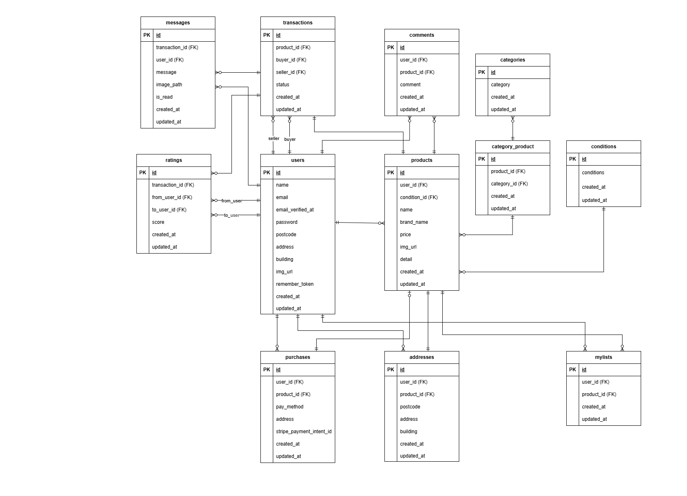

## 環境構築
**Dockerビルド**

1. `git clone git@github.com:kamihshi0422/free-market-pro.git`
2. `cd free-market-pro`
3. DockerDesktopアプリを立ち上げる
4. `docker-compose up -d --build`

**Laravel環境構築**

1. phpコンテナへ入る
``` bash
docker-compose exec php bash
```

2. `composer install`

> _composerインストールでエラーが発生した際は、phpコンテナ内で以下のコマンドを実行してから再度composerインストールを実行してください。
> Laravelアプリが正常に動作するためのフォルダ作成と権限の変更になります。_

```bash
mkdir -p bootstrap/cache storage/framework/cache/data
mkdir -p storage/framework/views
mkdir -p storage/framework/sessions
mkdir -p storage/framework/testing
chown -R www-data:www-data storage bootstrap/cache
chmod -R 775 storage bootstrap/cache
```

3. 「.env.example」ファイルを コピーして「.env」と命名
4.  .envに以下の環境変数を追加

``` text
DB_USERNAME=laravel_user
DB_PASSWORD=laravel_pass
```

5. アプリケーションキーの作成

``` bash
php artisan key:generate
```

> _.env を変更した際、反映されないことがあるため、phpコンテナ内でまとめて以下を実行してください。_

``` bash
docker-compose exec php bash
```
```bash
php artisan config:clear
php artisan cache:clear
php artisan route:clear
php artisan view:clear
composer dump-autoload
php artisan package:discover
php artisan config:cache
```

6. マイグレーションの実行

``` bash
php artisan migrate
```

7. シーディングの実行

``` bash
php artisan db:seed
```

8. 出品画像、プロフィール画像用のディレクトリ作成とサンプル画像の移動

- `mkdir -p src/storage/app/public`
- `mv img products_images user_images src/storage/app/public`

> _Permission denied（権限のエラー）が出た際、以下を実行してください。_

``` bash
sudo chmod -R 777 src/*
```

9.  画像ディレクトリを正常に作動させるため、phpコンテナ内で以下のコマンドを実行

``` bash
php artisan storage:link
chown -R www-data:www-data storage bootstrap/cache
chmod -R 775 storage bootstrap/cache
```

**Stripe 設定**
1. https://stripe.com/jp にサインアップ
2. ダッシュボードの「開発者」→「APIキー」から以下を取得
  - 公開可能キー (STRIPE_KEY)
  - シークレットキー (STRIPE_SECRET)
3. 上記で取得したAPIキーを.env に設定

``` text
STRIPE_KEY=pk_test_XXXXXXXXXXXX
STRIPE_SECRET=sk_test_XXXXXXXXXXXX
```

## テスト用環境設定

1. 「.env」ファイルを コピーして「.env.testing」と命名
2.  .env.testingに以下の環境変数を追加

```text
APP_ENV=test

DB_DATABASE=demo_test
DB_USERNAME=root
DB_PASSWORD=root
```
> _※DB_DATABASE=laravel_db のままだと本番DBが消えてしまいますのでご注意ください。_

3. テスト用DBを作成（ターミナルで実行）
``` bash
docker exec -it free-market-pro-mysql-1 mysql -u root -proot -e \
"CREATE DATABASE IF NOT EXISTS demo_test CHARACTER SET utf8mb4 COLLATE utf8mb4_unicode_ci;
GRANT ALL PRIVILEGES ON demo_test.* TO 'root'@'%';
FLUSH PRIVILEGES;"
```

4. .env.testingの設定反映（ターミナルで実行）
```bash
docker-compose exec php bash -c "
php artisan config:clear &&
php artisan cache:clear &&
php artisan route:clear &&
php artisan view:clear &&
composer dump-autoload &&
php artisan package:discover"
```

5. テスト専用マイグレーション

``` bash
php artisan migrate --env=testing
```

6. テスト専用シーディング

``` bash
php artisan db:seed --env=testing
```

7. テスト実行

``` bash
php artisan test tests/Feature --env=testing
```

## テストアカウント (ダミーデータ)
### name: ユーザー1
- email: user1@test.com
- password: password
- 出品商品:
  - C001: 腕時計
  - C002: HDD
  - C003: 玉ねぎ3束
  - C004: 革靴
  - C005: ノートPC
-------------------------
### name: ユーザー2
- email: user2@test.com
- password: password
- 出品商品:
  - C006: マイク
  - C007: ショルダーバッグ
  - C008: タンブラー
  - C009: コーヒーミル
  - C010: メイクセット
-------------------------
### name: ユーザー3
- email: user3@test.com
- password: password
- 出品商品: なし
-------------------------

## URL
- トップ画面 ：http://localhost/
- 会員登録画面 :http://localhost/register
- phpMyAdmin:：http://localhost:8080/
- MailHog ：http://localhost:8025/

## 補足 (Pro入会テスト)
- 取引完了メールを確認する際は、MailHog（http://localhost:8025/） からご確認いただけます。

## 追加機能の説明 (模擬試験１)
**コーチの確認・許可のもと、機能を加えています**
- メール認証画面で「認証はこちらから」ボタンを押下するとMailHog（http://localhost:8025/） に遷移し、認証するとプロフィール編集画面に遷移する。
- 未承認ユーザーが認証が必要なアクションを行いログインした場合、元の画面に遷移する
  - 例：商品詳細画面で「いいね」後ログイン → 商品詳細画面に戻る
  - 例：マイページボタン → ログイン後マイページに遷移
- 商品出品画面、プロフィール編集、送付先住所変更のエラーメッセージは要件定義にないため独自実装
- 購入済商品の挙動：
  - 詳細画面は表示可能
  - 購入手続きボタンは非表示
- 購入するボタンを押下時、トップページに戻り、Stipe画面に遷移を別タブで行うためにJavaScriptを使用しています

## 使用技術(実行環境)
- PHP8.1 (php-fpm)
- Laravel 8.83.8
- MySQL 8.0.26
- nginx 1.21.1
- Docker / Docker Compose

## ER 図


## テーブル仕様書

## 1. users テーブル
| No. | カラム名 | 型 | PRIMARY KEY | UNIQUE KEY | NOT NULL | FOREIGN KEY |
|-----|----------|----|-------------|------------|----------|-------------|
| 1 | id | unsigned bigint | ○ |  | ○ |  |
| 2 | name | string |  |  | ○ |  |
| 3 | email | string |  | ○ | ○ |  |
| 4 | email_verified_at | timestamp |  |  |  |  |
| 5 | password | string |  |  | ○ |  |
| 6 | postcode | string |  |  |  |  |
| 7 | address | string |  |  |  |  |
| 8 | building | string |  |  |  |  |
| 9 | img_url | string |  |  |  |  |
|10 | remember_token | string |  |  |  |  |
|11 | created_at | timestamp |  |  |  |  |
|12 | updated_at | timestamp |  |  |  |  |


## 2. products テーブル
| No. | カラム名 | 型 | PRIMARY KEY | UNIQUE KEY | NOT NULL | FOREIGN KEY |
|-----|----------|----|-------------|------------|----------|-------------|
| 1 | id | unsigned bigint | ○ |  | ○ |  |
| 2 | user_id | unsigned bigint |  |  | ○ | users(id) |
| 3 | condition_id | unsigned bigint |  |  | ○ | conditions(id) |
| 4 | name | string |  |  | ○ |  |
| 5 | brand_name | string |  |  |  |  |
| 6 | price | integer |  |  | ○ |  |
| 7 | img_url | string |  |  | ○ |  |
| 8 | detail | text |  |  | ○ |  |
| 9 | created_at | timestamp |  |  |  |  |
|10 | updated_at | timestamp |  |  |  |  |


## 3. categories テーブル
| No. | カラム名 | 型 | PRIMARY KEY | UNIQUE KEY | NOT NULL | FOREIGN KEY |
|-----|----------|----|-------------|------------|----------|-------------|
| 1 | id | unsigned bigint | ○ |  | ○ |  |
| 2 | category | string |  |  | ○ |  |
| 3 | created_at | timestamp |  |  |  |  |
| 4 | updated_at | timestamp |  |  |  |  |


## 4. category_product テーブル
| No. | カラム名 | 型 | PRIMARY KEY | UNIQUE KEY | NOT NULL | FOREIGN KEY |
|-----|----------|----|-------------|------------|----------|-------------|
| 1 | id | unsigned bigint | ○ |  | ○ |  |
| 2 | product_id | unsigned bigint |  |  | ○ | products(id) |
| 3 | category_id | unsigned bigint |  |  | ○ | categories(id) |
| 4 | created_at | timestamp |  |  |  |  |
| 5 | updated_at | timestamp |  |  |  |  |


## 5. conditions テーブル
| No. | カラム名 | 型 | PRIMARY KEY | UNIQUE KEY | NOT NULL | FOREIGN KEY |
|-----|----------|----|-------------|------------|----------|-------------|
| 1 | id | unsigned bigint | ○ |  | ○ |  |
| 2 | condition | string |  |  | ○ |  |
| 3 | created_at | timestamp |  |  |  |  |
| 4 | updated_at | timestamp |  |  |  |  |


## 6. purchases テーブル
| No. | カラム名 | 型 | PRIMARY KEY | UNIQUE KEY | NOT NULL | FOREIGN KEY |
|-----|----------|----|-------------|------------|----------|-------------|
| 1 | id | unsigned bigint | ○ |  | ○ |  |
| 2 | user_id | unsigned bigint |  |  | ○ | users(id) |
| 3 | product_id | unsigned bigint |  |  | ○ | products(id) |
| 4 | pay_method | tinyInteger |  |  | ○ |  |
| 5 | address | string |  |  |  |  |
| 6 | stripe_payment_intent_id | string |  |  |  |  |
| 7 | created_at | timestamp |  |  |  |  |
| 8 | updated_at | timestamp |  |  |  |  |


## 7. comments テーブル
| No. | カラム名 | 型 | PRIMARY KEY | UNIQUE KEY | NOT NULL | FOREIGN KEY |
|-----|----------|----|-------------|------------|----------|-------------|
| 1 | id | unsigned bigint | ○ |  | ○ |  |
| 2 | user_id | unsigned bigint |  |  | ○ | users(id) |
| 3 | product_id | unsigned bigint |  |  | ○ | products(id) |
| 4 | comment | text |  |  | ○ |  |
| 5 | created_at | timestamp |  |  |  |  |
| 6 | updated_at | timestamp |  |  |  |  |


## 8. mylists テーブル
| No. | カラム名 | 型 | PRIMARY KEY | UNIQUE KEY | NOT NULL | FOREIGN KEY |
|-----|----------|----|-------------|------------|----------|-------------|
| 1 | id | unsigned bigint | ○ |  | ○ |  |
| 2 | user_id | unsigned bigint |  |  | ○ | users(id) |
| 3 | product_id | unsigned bigint |  |  | ○ | products(id) |
| 4 | created_at | timestamp |  |  |  |  |
| 5 | updated_at | timestamp |  |  |  |  |


## 9. addresses テーブル
| No. | カラム名 | 型 | PRIMARY KEY | UNIQUE KEY | NOT NULL | FOREIGN KEY |
|-----|----------|----|-------------|------------|----------|-------------|
| 1 | id | unsigned bigint | ○ |  | ○ |  |
| 2 | user_id | unsigned bigint |  |  | ○ | users(id) |
| 3 | product_id | unsigned bigint |  |  | ○ | products(id) |
| 4 | postcode | string |  |  | ○ |  |
| 5 | address | string |  |  | ○ |  |
| 6 | building | string |  |  |  |  |
| 7 | created_at | timestamp |  |  |  |  |
| 8 | updated_at | timestamp |  |  |  |  |


## 10. transactions テーブル
| No. | カラム名 | 型 | PRIMARY KEY | UNIQUE KEY | NOT NULL | FOREIGN KEY |
|-----|----------|----|-------------|------------|----------|-------------|
| 1 | id | unsigned bigint | ○ |  | ○ |  |
| 2 | product_id | unsigned bigint |  |  | ○ | products(id) |
| 3 | buyer_id | unsigned bigint |  |  | ○ | users(id) |
| 4 | seller_id | unsigned bigint |  |  | ○ | users(id) |
| 5 | status | tinyInteger |  |  | ○ |  |
| 6 | created_at | timestamp |  |  |  |  |
| 7 | updated_at | timestamp |  |  |  |  |


## 11. messages テーブル
| No. | カラム名 | 型 | PRIMARY KEY | UNIQUE KEY | NOT NULL | FOREIGN KEY |
|-----|----------|----|-------------|------------|----------|-------------|
| 1 | id | unsigned bigint | ○ |  | ○ |  |
| 2 | transaction_id | unsigned bigint |  |  | ○ | transactions(id) |
| 3 | user_id | unsigned bigint |  |  | ○ | users(id) |
| 4 | message | text |  |  | ○ |  |
| 5 | image_path | string |  |  |  |  |
| 6 | is_read | boolean |  |  | ○ |  |
| 7 | created_at | timestamp |  |  |  |  |
| 8 | updated_at | timestamp |  |  |  |  |


## 12. ratings テーブル
| No. | カラム名 | 型 | PRIMARY KEY | UNIQUE KEY | NOT NULL | FOREIGN KEY |
|-----|----------|----|-------------|------------|----------|-------------|
| 1 | id | unsigned bigint | ○ |  | ○ |  |
| 2 | transaction_id | unsigned bigint |  | ○ | ○ | transactions(id) |
| 3 | from_user_id | unsigned bigint |  |  | ○ | users(id) |
| 4 | to_user_id | unsigned bigint |  |  | ○ | users(id) |
| 5 | score | unsignedTinyInteger |  |  | ○ |  |
| 6 | created_at | timestamp |  |  |  |  |
| 7 | updated_at | timestamp |  |  |  |  |

## Tree
```text
.
├── ER.drawio.png
├── README.md
├── docker
│   ├── mysql
│   ├── nginx
│   └── php
├── docker-compose.yml
├── img
│   └── logo.svg
├── products_images
│   ├── Armani+Mens+Clock.jpg
│   ├── Armani+Mens+Clock.jpg:Zone.Identifier
│   ├── DZfq97c6t736jEhEQtmC7cwGWo0MRVcmFhY9Okyt.png
│   ├── HDD+Hard+Disk.jpg
│   ├── HDD+Hard+Disk.jpg:Zone.Identifier
│   ├── Leather+Shoes+Product+Photo.jpg
│   ├── Leather+Shoes+Product+Photo.jpg:Zone.Identifier
│   ├── Living+Room+Laptop.jpg
│   ├── Living+Room+Laptop.jpg:Zone.Identifier
│   ├── Music+Mic+4632231.jpg
│   ├── Music+Mic+4632231.jpg:Zone.Identifier
│   ├── NFdsmUJv3Lt7lGh4zESRUZLogAVW5aUBxQOZ2UaP.png
│   ├── Purse+fashion+pocket.jpg
│   ├── Purse+fashion+pocket.jpg:Zone.Identifier
│   ├── Tumbler+souvenir.jpg
│   ├── Tumbler+souvenir.jpg:Zone.Identifier
│   ├── Waitress+with+Coffee+Grinder.jpg
│   ├── Waitress+with+Coffee+Grinder.jpg:Zone.Identifier
│   ├── comment.png
│   ├── djoT7Wxqp4HmD6Zs5UoBGHGIjBVsUu2XArqQIZMq.png
│   ├── iLoveIMG+d.jpg
│   ├── iLoveIMG+d.jpg:Zone.Identifier
│   ├── inputButton.jpg
│   ├── like.png
│   ├── p2TZGzgIrbZ0DHEH4l3DFXH21hdDrnvzsOj9bnRC.png
│   ├── 外出メイクアップセット.jpg
│   └── 外出メイクアップセット.jpg:Zone.Identifier
├── src
│   ├── app
│   ├── artisan
│   ├── bootstrap
│   ├── composer.json
│   ├── composer.lock
│   ├── config
│   ├── database
│   ├── package.json
│   ├── phpunit.xml
│   ├── public
│   ├── resources
│   ├── routes
│   ├── server.php
│   ├── storage
│   ├── tests
│   ├── vendor
│   └── webpack.mix.js
└── user_images
    ├── icon1.png
    ├── icon2.png
    └── icon3.png
